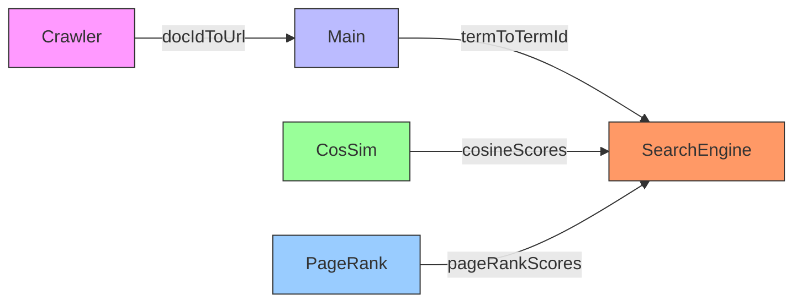

# Search Engine Project 🔍

A Java-based web search engine with crawling, indexing, and ranking capabilities. The system processes web pages, builds inverted indexes, and ranks documents using **cosine similarity** and **PageRank**.

---

## Features ✨
- **Web Crawler**: Extracts URLs, titles, and content from web pages.
- **Inverted Index**: Efficiently stores terms with document IDs, frequencies, and positions.
- **Text Processing**: Stopword removal and Porter stemming.
- **Ranking Algorithms**:
  - **Cosine Similarity (TF-IDF)**: Measures query-document relevance.
  - **PageRank**: Computes page importance based on link structure.
- **Search Interface**: Returns top 10 results with contextual snippets.
  - **Pure cosine similarity** (TF-IDF)  
  - **Combined score** (cosine similarity × PageRank).
---

## Components 🧩

| File               | Description                                                                 |
|--------------------|-----------------------------------------------------------------------------|
| `Crawler.java`     | Crawls web pages, extracts content, and builds document mappings.           |
| `InvertedIndex.java` | Persistent inverted index using JDBM (stores postings: docID, freq, positions). |
| `StopStem.java`    | Removes stopwords and applies stemming to terms.                            |
| `CosSim.java`      | Calculates cosine similarity between queries and documents.                 |
| `PageRank.java`    | Computes PageRank scores for pages using the link matrix.                   |
| `SearchEngine.java` | Combines ranking algorithms and returns search results.                     |
| `Main.java`        | Orchestrates crawling, indexing, and interactive searching.                 |

---
## Data Structures 📊
- **`TermInfo`**: Tracks term metadata (ID, document frequency).
- **`WordInfo`**: Records term positions and frequencies per document.
- **`Posting`**: Inverted index entry (`docID`, `frequency`, `positions`).

### **Map Variables Overview**
| Map Variable | Type | Purpose | Key → Value | Used In |
|-------------|------|---------|-------------|---------|
| `docIdToUrl` | `Map<Object, String[]>` | Maps document IDs to URL and title | `docId` → `[url, title]` | `Crawler.java` |
| `urlToDocId` | `Map<String, Integer>` | Maps URLs to document IDs | `url` → `docId` | `Crawler.java` |
| `docIdToTerms` | `Map<Integer, Vector<String>>` | Maps document IDs to term lists | `docId` → `Vector<terms>` | `Crawler.java` |
| `termToTermId` | `Map<String, TermInfo>` | Maps terms to their metadata (ID, frequency) | `term` → `TermInfo` | `Main.java`, `SearchEngine.java` |
| `bodyIndex` (HTree) | `Map<String, List<Posting>>` | Inverted index for body content | `term` → `List<Posting>` | `InvertedIndex.java`, `SearchEngine.java` |
| `pageRankScores` | `Map<Integer, Double>` | Stores PageRank scores per document | `docId` → `score` | `PageRank.java`, `SearchEngine.java` |
| `cosineScores` | `Map<Integer, Object[]>` | Stores cosine similarity results | `docId` → `[score, positions]` | `CosSim.java`, `SearchEngine.java` |
| `combinedScores` | `Map<Integer, Object[]>` | Stores combined (cosine × PageRank) scores | `docId` → `[cosSim, pageRank, combined, positions]` | `SearchEngine.java` |

**Key Notes**:
- **Forward Indexes**: `docIdToTerms` (document → terms).
- **Inverted Indexes**: `bodyIndex` (term → documents).
- **Metadata Maps**: `termToTermId` (term statistics).

---

## Usage 🚀

### Prerequisites
- Java 8+
- Maven (for dependency management)
- Libraries: `JDBM`, `HTMLParser`
